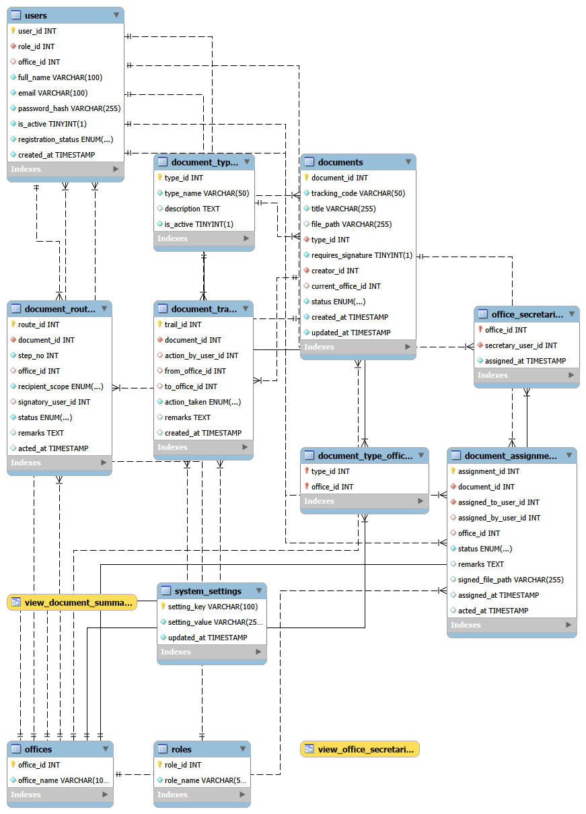

# DocuFlow — CCDEVAP-S16-5

**DocuFlow** is a LAMP Stack web application for tracking, routing, and managing documents across offices within an organization. It supports three user roles; **Admin**, **Secretary**, and **Member**, and follows the **MVC (Model-View-Controller)** design pattern.

> **Live Deployment:** [http://ccscloud.dlsu.edu.ph:60147/docuflow/CCDEVAP-S16-5-Docuflow/views/login.php](http://ccscloud.dlsu.edu.ph:60147/docuflow/CCDEVAP-S16-5-Docuflow/views/login.php)

---

## Table of Contents

1. [Project Overview](#1-project-overview)
2. [System Requirements](#2-system-requirements)
3. [Local Setup & Installation](#3-local-setup--installation)
4. [Database Setup](#4-database-setup)
5. [MVC Project Structure](#5-mvc-project-structure)
6. [Sample User Accounts](#6-sample-user-accounts)
7. [ERD (Entity-Relationship Diagram)](#7-erd-entity-relationship-diagram)
8. [Dependencies & Libraries](#8-dependencies--libraries)
9. [Security Implementations](#9-security-implementations)
10. [Running Automated Unit Tests](#10-running-automated-unit-tests)
11. [Deliverables](#11-deliverables)

---

## 1. Project Overview

DocuFlow is a document routing system that allows:

- **Admins** to manage users, offices, document types, routing workflows, system settings, and view analytics.
- **Secretaries** to create document requests, assign documents to members, and forward them between offices.
- **Members** to review assigned documents, upload attachments, digitally sign, or reject documents, and generate personal activity reports.

All document interactions are persisted in the database and tracked via an audit trail.

---

## 2. System Requirements

| Component | Requirement |
| :--- | :--- |
| Web Server | Apache (via XAMPP 8.x or standalone) |
| PHP | PHP **8.0** or higher |
| PHP Extensions | PDO, PDO_MySQL, OpenSSL, Fileinfo |
| Database | MySQL / MariaDB |
| Browser | Any modern browser (Chrome, Firefox, Edge) |
| Composer | Required only for running PHPUnit tests |

---

## 3. Local Setup & Installation

### Step 1 — Install XAMPP

Download and install [XAMPP](https://www.apachefriends.org/) if not already installed. Start both **Apache** and **MySQL** from the XAMPP Control Panel.

### Step 2 — Place the Project

Clone or place the project folder into your XAMPP `htdocs` directory:

```
C:\xampp\htdocs\CCDEVAP-S16-5-Docuflow\
```

### Step 3 — Configure the Database Connection

Open `config/connections.php`. By default, the connection uses environment variables with fallbacks:

```php
$databaseHost     = getenv('DOCUFLOW_DB_HOST')     ?: 'localhost';
$databaseName     = getenv('DOCUFLOW_DB_NAME')     ?: 'docuflow_db';
$databaseUser     = getenv('DOCUFLOW_DB_USER')     ?: 'root';
$databasePassword = getenv('DOCUFLOW_DB_PASSWORD') ?: '';
```

If your MySQL root password differs from the default (empty), update the `DOCUFLOW_DB_PASSWORD` fallback or set the environment variable accordingly.

### Step 4 — Import the Database

1. Open phpMyAdmin at [http://localhost/phpmyadmin](http://localhost/phpmyadmin).
2. Create a new database named **`docuflow_db`**.
3. Select `docuflow_db`, click **Import**, and upload:
   ```
   docuflow_db_latest.sql
   ```
4. Click **Go**. The script will create all tables and insert sample seed data.

### Step 5 — Open the Application

Navigate to:

```
http://localhost/CCDEVAP-S16-5-Docuflow/views/login.php
```

Use any of the sample credentials from the [Sample User Accounts](#6-sample-user-accounts) section below.

---

## 4. Database Setup

The file `docuflow_db_latest.sql` contains:

- All table definitions (roles, offices, users, document_types, document_requests, documents, document_routes, document_trails, settings).
- Pre-seeded sample data with **at least 5 records per entity and type** (e.g., 5+ approved users per role, 5+ documents per status).
- Hashed passwords for all seed user accounts using PHP `password_hash()`.

---

## 5. MVC Project Structure

```
CCDEVAP-S16-5-Docuflow/
├── config/
│   └── connections.php          # PDO database connection
├── controllers/                 # Controller layer — handles request logic
│   ├── LoginController.php
│   ├── RegisterController.php
│   ├── LogoutController.php
│   ├── AdminUsersController.php
│   ├── AdminOfficesController.php
│   ├── AdminDocumentTypesController.php
│   ├── AdminSettingsController.php
│   ├── AdminPendingUsersController.php
│   ├── AdminDashboardController.php
│   ├── SecretaryDashboardController.php
│   ├── SecretaryCreateController.php
│   ├── SecretaryAssignController.php
│   ├── SecretaryForwardController.php
│   ├── MemberDashboardController.php
│   ├── MemberSignController.php
│   ├── MemberRejectController.php
│   ├── MemberUploadController.php
│   ├── MemberReportController.php
│   └── ... (40 controllers total)
├── models/                      # Model layer — database abstraction
│   ├── user.php
│   ├── office.php
│   ├── document.php
│   ├── documentType.php
│   ├── documentRequest.php
│   ├── documentRoute.php
│   ├── documentTrail.php
│   ├── setting.php
│   ├── role.php
│   └── report.php
├── views/                       # View layer — HTML/PHP templates
│   ├── login.php
│   ├── register.php
│   ├── admin-dashboard.php
│   ├── admin-users.php
│   ├── admin-offices.php
│   ├── admin-document-types.php
│   ├── admin-settings.php
│   ├── admin-pending-users.php
│   ├── admin-chart-trends.php
│   ├── admin-chart-types.php
│   ├── admin-chart-bottlenecks.php
│   ├── secretary-dashboard.php
│   ├── member-dashboard.php
│   ├── member-document.php
│   ├── member-report.php
│   └── ... (33 views total)
├── css/                         # Stylesheets
├── js/                          # JavaScript files
├── helpers/                     # Shared utility helpers
├── uploads/                     # Uploaded PDF attachments
├── pdfs/                        # Processed document PDFs
├── test/                        # PHPUnit automated test suite
│   ├── models/                  # Model unit test classes
│   └── results/                 # Saved test output
├── phpunit.phar                 # PHPUnit test runner
├── phpunit.xml                  # PHPUnit configuration
├── composer.json
├── docuflow_db_latest.sql       # Database seed file
├── CREDENTIALS.md               # Full list of sample user accounts
├── TESTING.md                   # Comprehensive test plan & guide
└── README.md                    # This file
```

---

## 6. Sample User Accounts

All seed accounts use the default password: **`dlsu`**

### Administrators

| Full Name | Email | Password | Role |
| :--- | :--- | :---: | :---: |
| System Admin | `admin@docuflow.local` | `dlsu` | Admin |
| System Administrator | `admin@office.gov` | `dlsu` | Admin |

### Secretaries

| Full Name | Email | Password | Assigned Office |
| :--- | :--- | :---: | :--- |
| Registrar Secretary | `registrar.secretary@docuflow.local` | `dlsu` | Registrar Office |
| Finance Secretary | `finance.secretary@docuflow.local` | `dlsu` | Finance Office |
| Dean Secretary | `secretary@docuflow.local` | `dlsu` | Dean Office |
| IT Secretary | `it.secretary@docuflow.local` | `dlsu` | IT Office |
| HR Secretary | `hr.secretary@docuflow.local` | `dlsu` | Human Resources Office |
| Admissions Secretary | `admissions.secretary@docuflow.local` | `dlsu` | Admissions Office |
| R&D Secretary | `rnd.secretary@docuflow.local` | `dlsu` | Research & Development Office |

### Members (Approved)

| Full Name | Email | Password | Assigned Office |
| :--- | :--- | :---: | :--- |
| Juan Member | `juan.member@docuflow.local` | `dlsu` | Registrar Office |
| Maria Signatory | `member@docuflow.local` | `dlsu` | Finance Office |
| Sample Member | `member2@office.gov` | `dlsu` | Dean Office |
| Alex Santos | `alex.santos@docuflow.local` | `dlsu` | Registrar Office |
| Keith Rodriguez | `keith@docuflow.local` | `dlsu` | IT Office |
| Elena Gomez | `elena.gomez@docuflow.local` | `dlsu` | Human Resources Office |
| David Chen | `david.chen@docuflow.local` | `dlsu` | Finance Office |
| Patricia Cruz | `patricia.cruz@docuflow.local` | `dlsu` | Dean Office |
| Robert Taylor | `robert.taylor@docuflow.local` | `dlsu` | Admissions Office |
| Sophia Martinez | `sophia.martinez@docuflow.local` | `dlsu` | Research & Development Office |
| Liam Wilson | `liam.wilson@docuflow.local` | `dlsu` | IT Office |

### Members (Pending / Rejected — for Edge Case Testing)

| Full Name | Email | Password | Status |
| :--- | :--- | :---: | :---: |
| Shad Paje | `shad@paje.me` | `dlsu` | Pending |
| Carlos Reyes | `carlos.reyes@docuflow.local` | `dlsu` | Pending |
| Angela Diaz | `angela.diaz@docuflow.local` | `dlsu` | Pending |
| Marcus Vance | `marcus.vance@docuflow.local` | `dlsu` | Rejected |
| Jessica Alba | `jessica.alba@docuflow.local` | `dlsu` | Rejected |

> For the full credentials reference, see [`CREDENTIALS.md`](CREDENTIALS.md).

---

## 7. ERD (Entity-Relationship Diagram)



**Core Tables:**

| Table | Description |
| :--- | :--- |
| `roles` | User role definitions (Admin, Secretary, Member) |
| `offices` | Office records with assigned secretaries |
| `users` | User accounts with role, office, status, and hashed passwords |
| `document_types` | Configurable document types with multi-step routing |
| `document_type_offices` | Ordered routing steps per document type (office + target hours SLA) |
| `document_requests` | Member-initiated document requests (draft stage) |
| `documents` | Active routed documents with status tracking |
| `document_routes` | Per-office routing steps with signatory assignments and timestamps |
| `document_trails` | Full audit log of all document events and status changes |
| `system_settings` | System-wide configuration key-value store |

---

## 8. Dependencies & Libraries

### Back-End

- **PHP 8.0+** — Core server-side language
- **PDO (PHP Data Objects)** — Database abstraction layer with prepared statements
- **PHP `password_hash()` / `password_verify()`** — Native bcrypt password hashing (no external library required)
- **PHP Sessions (`$_SESSION`)** — Native session management for user authentication

### Front-End

- **Vanilla CSS** — Custom stylesheet design system (`css/stylelogin.css`, `css/style.css`, etc.)
- **Google Fonts (Inter)** — Modern sans-serif typography
- **Chart.js** — Interactive analytics charts (document trends, type distribution, office bottlenecks)
- **DataTables (jQuery plugin)** — Sortable, searchable, paginated data tables across all Admin, Secretary, and Member views
- **jQuery** — DOM manipulation and AJAX request handling

### Development & Testing

- **PHPUnit 10.5** (`phpunit.phar`) — Automated unit testing framework
- **Composer** — PHP dependency management (dev dependency for PHPUnit)

---

## 9. Security Implementations

- **Password Hashing** — All user passwords are stored as bcrypt hashes using PHP `password_hash(PASSWORD_DEFAULT)`. Plain-text passwords are never stored in the database.
- **Session-Based Authentication** — A PHP session is created on successful login and destroyed on logout or browser close. All protected views verify the session at the top of the page.
- **Role-Based Access Control (RBAC)** — Each protected view checks the authenticated user's role (`$_SESSION['role_id']`). Unauthorized role access is redirected to `login.php`.
- **Prepared Statements (PDO)** — All database queries use PDO prepared statements with bound parameters, preventing SQL injection.
- **XSS Prevention** — All user-supplied output is passed through `htmlspecialchars()` before rendering in views.
- **File Upload Restrictions** — The document upload system validates MIME type and file extension server-side, accepting PDF files only.
- **CSRF Awareness** — Form submissions are processed server-side via POST requests only, with session validation on all state-changing actions.
- **Secure Cookie Configuration** — Session cookies are configured with `HttpOnly` to prevent client-side JavaScript access.

---

## 10. Running Automated Unit Tests

PHPUnit test classes are located in `test/models/` and cover all database model functions.

### Prerequisites

Ensure the database is seeded and `config/connections.php` points to a running MySQL instance before running tests.

### Run a Single Model Test

```powershell
C:\xampp\php\php.exe phpunit.phar test/models/UserModelTest.php
```

### Run the Full Test Suite

```powershell
C:\xampp\php\php.exe phpunit.phar
```

### Test Coverage Summary

| Test Class | Model | Tests |
| :--- | :--- | :--- |
| `UserModelTest.php` | `user.php` | Find by email, email exists, create, approve/reject, set active, delete, update password |
| `OfficeModelTest.php` | `office.php` | Get directory, count all, create, set active, delete |
| `DocumentModelTest.php` | `document.php` | Count all/by status, get by office, status distribution |
| `DocumentTypeModelTest.php` | `documentType.php` | Get all active, type exists, create with offices, delete |
| `DocumentRequestModelTest.php` | `documentRequest.php` | Create, get by user, count by user, delete pending |
| `DocumentRouteModelTest.php` | `documentRoute.php` | Count by signatory/status, get pending, sign route (true/false) |
| `DocumentTrailModelTest.php` | `documentTrail.php` | Add entry, get by document, get recent |
| `RoleModelTest.php` | `role.php` | Get all, empty result |
| `SettingModelTest.php` | `setting.php` | Get with default, set/upsert, requires admin approval |

**Latest test run result:** `OK — 36 tests, 109 assertions` (see [`phpunit-results.txt`](phpunit-results.txt) for full output).

---

## 11. Deliverables

1. **Deployed Website:** [http://ccscloud.dlsu.edu.ph:60147/docuflow/CCDEVAP-S16-5-Docuflow/views/login.php](http://ccscloud.dlsu.edu.ph:60147/docuflow/CCDEVAP-S16-5-Docuflow/views/login.php)
2. **GitHub Repository:** [https://github.com/shadrachdlsu/CCDEVAP-S16-5-Docuflow](https://github.com/shadrachdlsu/CCDEVAP-S16-5-Docuflow)
3. **Database File:** `docuflow_db_latest.sql` (included in the repository root; zipped as `CCDEVAP-S16-5-DocuflowDB.zip` for submission)
4. **Zipped Project Folder:** `CCDEVAP-S16-5-Docuflow.zip` (downloaded from GitHub, named per repository convention)
5. **Sample User Accounts Table:** See [Section 6](#6-sample-user-accounts) above and [`CREDENTIALS.md`](CREDENTIALS.md)
6. **ERD:** See [Section 7](#7-erd-entity-relationship-diagram) above
7. **Dependencies & Security:** See [Section 8](#8-dependencies--libraries) and [Section 9](#9-security-implementations) above
